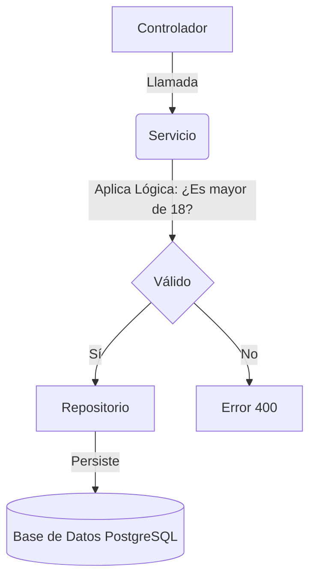

# Lógica de Negocio y Métodos Personalizados

En este proyecto, aprenderemos dos cosas fundamentales:

1. **¿Qué es la lógica de negocio?**
   Es el conjunto de reglas que rigen cómo manejamos la información en el programa. No se trata solo de guardar datos, sino de asegurarnos de que tengan sentido. En nuestra aplicación, hemos definido estas reglas:
   - **No permitimos usuarios menores de 18 años**: Solo personas mayores de edad pueden registrarse.
   - **El email debe ser único**: No queremos que dos personas tengan el mismo correo electrónico en nuestra base de datos.
   
   Estas reglas **DEBEN** estar en la clase `UsuarioService.java`. ¿Por qué? Porque el servicio es donde el código "piensa" y "toma decisiones". Si ponemos estas reglas en el controlador, estaríamos mezclando la gestión de la red con el comportamiento del negocio.

2. **¿Qué son los métodos personalizados?**
   A veces, los métodos estándar de Spring Data JPA (como `findAll` o `findById`) no son suficientes. Por ejemplo, si queremos buscar a todos los usuarios que tengan entre 18 y 30 años. Para eso, usamos métodos personalizados en la interfaz `UsuarioRepository.java`.

Existen dos tipos que hemos usado en este ejemplo:
   - **Query Methods**: Spring Data JPA adivina qué queremos hacer basándose en el nombre del método (ejemplo: `findByEmail`).
   - **@Query (JPQL)**: Cuando la lógica es más compleja, escribimos nuestra propia consulta usando `@Query`. Ejemplo: buscar por un rango de edad.

## Ejemplo Visual:

## Pruebas Sugeridas:

Si quieres ver el sistema en acción, utiliza una herramienta como **Postman**, **Insomnia** o incluso el comando `curl`:

1.  **Intenta crear un usuario de 15 años:** Deberías recibir un mensaje de error que dice "Lógica de Negocio: El usuario debe ser mayor de 18 años.".
2.  **Intenta crear dos usuarios con el mismo email:** El segundo intento te dará un error de email en uso.
3.  **Inspecciona los datos:** Utiliza un cliente de base de datos (como **pgAdmin**, **DBeaver** o la terminal `psql`) para conectarte a tu instancia de PostgreSQL y verificar que los usuarios se han guardado correctamente en la tabla `usuarios`.
